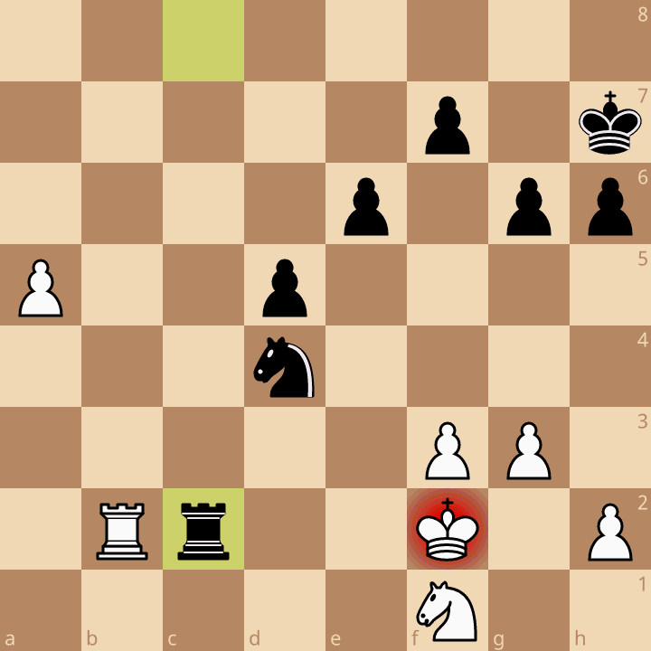
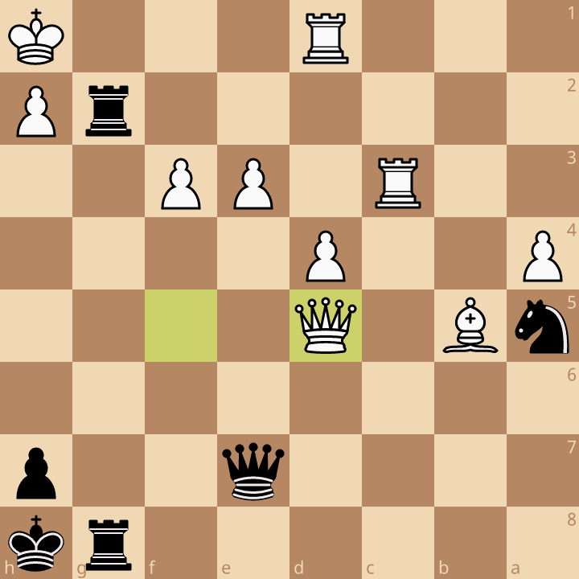
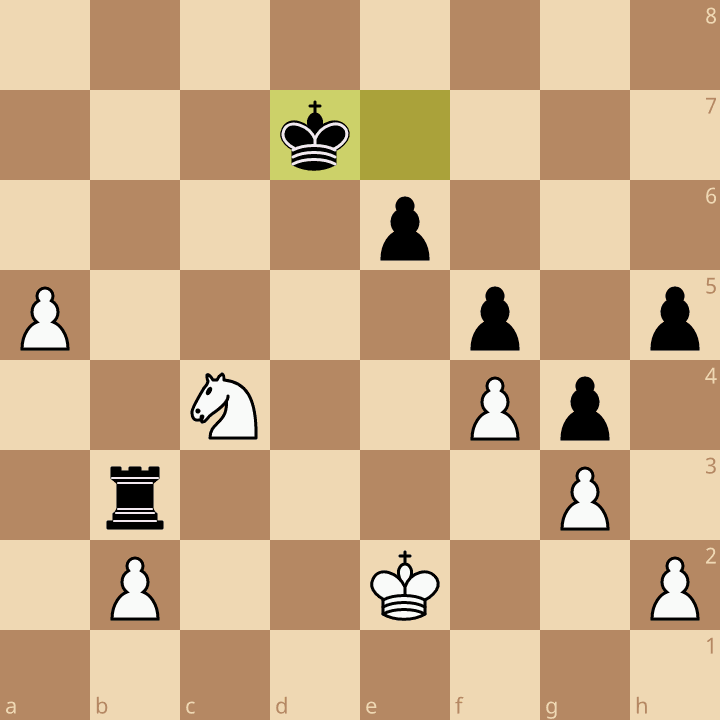

<h1 align="center">♞ daily-chess</h1>

<p align="center">
  <strong>A daily chess break, right in Slack.</strong><br>
  Three Lichess puzzles: easy, medium, and hard.
</p>

<p align="center">
  <a href="#quick-start">Quick start</a> ·
  <a href="#commands">Commands</a> ·
  <a href="#configuration">Configuration</a> ·
  <a href="#running-the-bot">Running the bot</a> ·
  <a href="#development">Development</a>
</p>

| [Easy](https://lichess.org/training/M71K7) | [Medium](https://lichess.org/training/aJUMo) | [Hard](https://lichess.org/training/VgIPd) |
| :---: | :---: | :---: |
|  |  |  |
| White to move | Black to move | White to move |

*Sample positions from [Lichess](https://lichess.org). In Slack, each card shows its rating and includes **View full board** and **Submit answer** buttons.*

- **Play in Slack.** Submit the first move and get private feedback.
- **Make it a habit.** Pick a daily time and subscribe to thread mentions.
- **Share the challenge.** Contribute puzzles, post extra sets, and race for a daily top-three place.

## Quick start

You'll need Git, [uv](https://docs.astral.sh/uv/getting-started/installation/), Linux or macOS, and permission to install a Slack app. The launcher uses uv to set up Python 3.11+ and install locked dependencies.

### 1. Get the project

```sh
git clone https://github.com/sean9892/daily-chess.git
cd daily-chess
cp .env.example .env
```

### 2. Connect Slack

In [Slack app settings](https://api.slack.com/apps), create an app **From a manifest** using [assets/slack-manifest.json](assets/slack-manifest.json). It includes the required bot permissions and enables Socket Mode, so no public request URL is needed.

Install the app to your workspace and invite `daily-chess` to your channel. Fill in these values in `.env`:

| Variable | Where to find it |
| --- | --- |
| `SLACK_BOT_TOKEN` | **OAuth & Permissions → Bot User OAuth Token** (`xoxb-...`). |
| `SLACK_APP_TOKEN` | **Basic Information → App-Level Tokens**: generate an `xapp-...` token with `connections:write`. |
| `SLACK_CHANNEL_ID` | The destination channel's details; use its ID, not its name. |

### 3. Start posting

Choose `POST_TIME` and `TIMEZONE` in `.env` (defaults: `09:00`, `Asia/Seoul`), then run:

```sh
./scripts/start.sh
```

In the configured Slack channel, run `/daily-chess post` to publish your first set immediately. Use `/daily-chess subscribe` to get mentioned in each puzzle post's thread.

## Commands

Run commands in the configured channel. Command replies and answer feedback are visible only to you.

| Command | What it does |
| --- | --- |
| `/daily-chess submit M71K7` | Queue a puzzle. A Lichess training URL also works. |
| `/daily-chess answer <id> <move>` | Answer a puzzle posted today; its ID is on the card. |
| `/daily-chess post` | Publish an extra set and notify subscribers. |
| `/daily-chess subscribe` | Get mentioned in each puzzle post's thread. |
| `/daily-chess unsubscribe` | Stop those mentions. |
| `/daily-chess help` | Show command help. |

### Answers and rankings

Use **Submit answer** on a card or the `answer` command. Enter only the first move in algebraic notation: `Nf3`, `Rxe7`, `O-O`, or `e8=Q`. Incorrect answers can be retried. Puzzles must have been posted today, as determined by `TIMEZONE`.

Each user earns one place per difficulty per day across scheduled and manual posts. The first three places get solver mentions in the puzzle thread, also broadcast to the channel. Later solvers receive private confirmation.

The next scheduled post also recaps the previous calendar day's scheduled puzzles: the first three solvers per difficulty, shown by nickname without mentions. These rankings are separate from the daily places above, exclude manual puzzles, and show `No solvers` for unsolved difficulties.

## Configuration

All settings live in `.env`; [.env.example](.env.example) contains the required Slack values and these defaults:

| Variable | Default | Purpose |
| --- | --- | --- |
| `POST_TIME` | `09:00` | Daily local time in 24-hour `HH:MM` format. |
| `TIMEZONE` | `Asia/Seoul` | IANA timezone for scheduling and rankings. |
| `HISTORY_DAYS` | `365` | Days before a posted puzzle can be reused. |
| `EASY_MAX_RATING` | `1400` | Inclusive upper rating for easy submissions. |
| `MEDIUM_MAX_RATING` | `1800` | Inclusive upper rating for medium submissions. |
| `DATABASE_PATH` | `data/daily-chess.sqlite3` | Persistent SQLite database. |
| `TEMPLATE_PATH` | `assets/daily_message.txt` | Post introduction template. |
| `FETCH_ATTEMPTS` | `20` | Maximum random puzzle attempts per empty queue. |

Rating limits must be integers with `0 <= EASY_MAX_RATING < MEDIUM_MAX_RATING`. `HISTORY_DAYS` and `FETCH_ATTEMPTS` must be positive integers.

To customize the introduction, edit [assets/daily_message.txt](assets/daily_message.txt). It supports `{date}`, `{easy_rating}`, `{medium_rating}`, and `{hard_rating}`. Use `{{` and `}}` for literal braces; the rendered message must contain 1–3,000 characters.

## Running the bot

Keep one instance running under your service manager. Preserve `DATABASE_PATH`: it stores queues, subscriptions, rankings, and delivery progress. Restart after changing `.env` or the message template.

<details>
<summary>Puzzle selection, scheduling, and retries</summary>

- **Selection:** Submitted puzzles are validated through Lichess and queued by rating: easy through `EASY_MAX_RATING`, medium through `MEDIUM_MAX_RATING`, then hard. The oldest puzzle in each queue goes first. Empty queues use Lichess's random `easier`, `normal`, and `harder` bands, which can fall outside the submission rating limits.
- **Duplicates:** Queued puzzles and puzzles posted within `HISTORY_DAYS` cannot be added again. Scheduled and manual posts share queues and duplicate checks.
- **Scheduling:** The bot checks every 30 seconds and posts once per local day. After downtime, it catches up today's post and retries unfinished scheduled deliveries, without creating posts for other missed days. Failed ranking announcements retry automatically.
- **Manual posts:** `/daily-chess post` leaves the daily schedule intact. If delivery fails, run it again to resume the oldest unfinished manual post, including after a restart.
- **Delivery:** A timeout after Slack accepts a message can cause a duplicate on retry.

</details>

## Development

```text
src/daily_chess/  Bot, Lichess client, and SQLite storage
assets/          Message template, Slack manifest, and README previews
data/            Runtime database
scripts/         Launcher
tests/           Bot and Lichess client tests
```

Run the tests from the repository root:

```sh
uv run --locked python -m unittest discover -s tests
```
